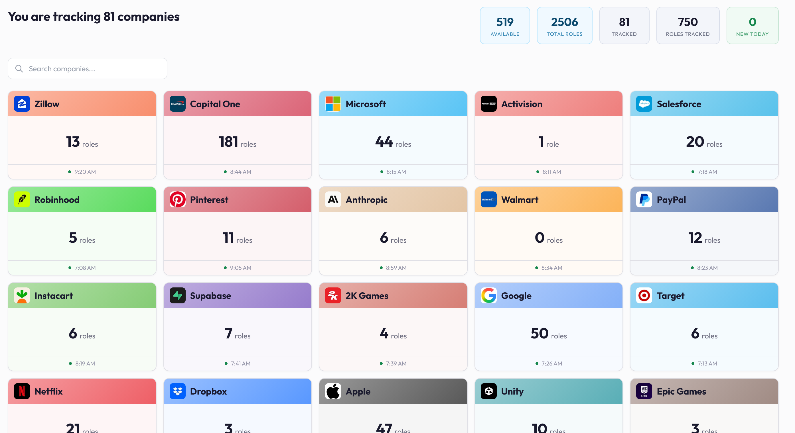
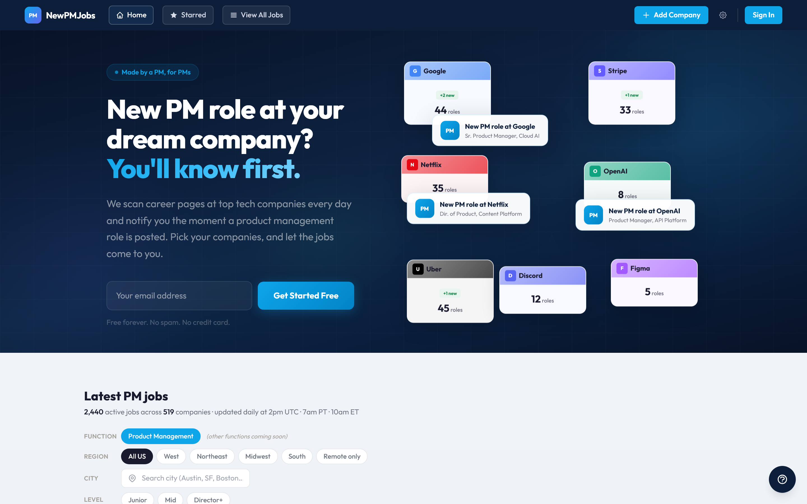
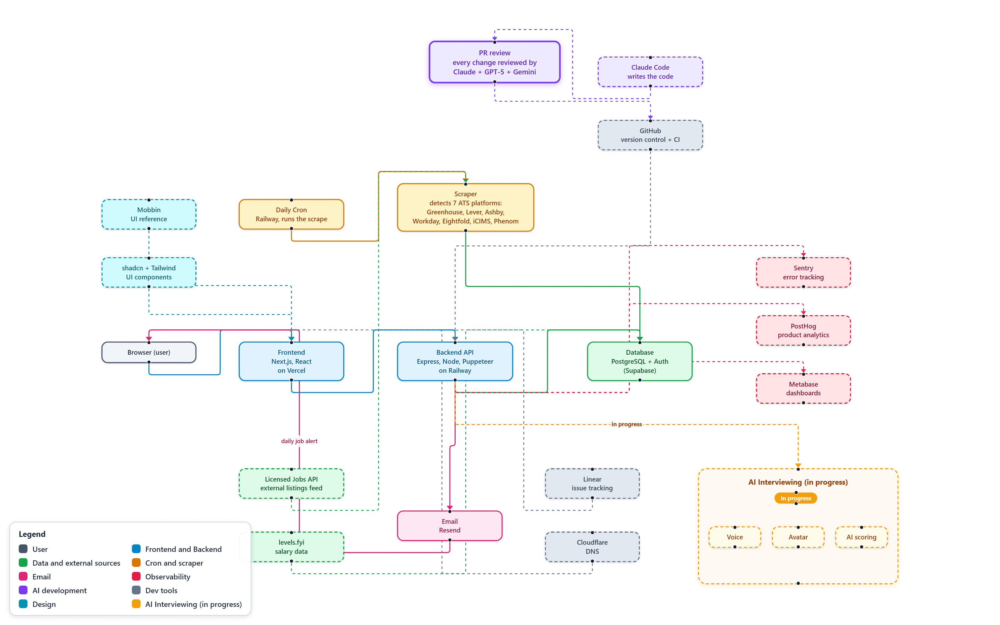

# NewPMJobs Product Journey

I spent years on the job hunt. Thousands of applications, a long run of bombed interviews, the whole grind. And the part that wore me down most? Never knowing when the right role actually opened. The good ones go fast, and checking thirty career pages by hand every morning is its own special misery.

So I built the thing I wished I'd had.

NewPMJobs is simple where it counts. You pick the companies you'd actually want to work for, and every morning you get one email with the new PM roles. Straight from each company's own careers page. Filtered down to what fits. No noise, no stale listings.

The simple email is the easy part. Under it is a real production system, and that's the part I'm proud of.

- **A full product, not a toy.** Scraping, a self-healing data pipeline, a web app, a daily email and full monitoring. All live, all serving real users.
- **A PM built it, AI wrote the code.** I made every product, design and architecture call. The AI did the typing. The interesting thing isn't that AI can write code. It's that one PM can take a real, monitored, multi-user product from idea to production by making the calls an engineer usually makes.
- **Reliability is the actual feature.** A job alert that quietly drops a role is worse than no alert. So most of the work went into catching the silent failures, a broken scraper, a quiet zero, a missed send, before a user feels them.

A few numbers, because numbers beat adjectives. Page speed went from 49 to 100. Sub-second data calls replaced multi-minute browser scrapes. The catalog grew to 519 companies across 7 hiring platforms.

## The full story

Want the whole thing? **[Read the full journey here.](https://viktoriousllc.github.io/newpmjobs-product-journey/)** 33 phases, grouped into 6 stages, with the architecture and the real reason behind every decision.

## The product

## How it's built

